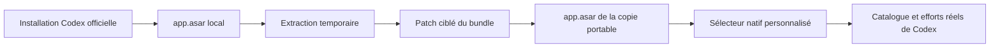

# Codex Native Selector

> Une personnalisation locale du sélecteur de modèles de Codex Desktop, construite à partir de l’installation Codex déjà présente sur Windows.

[](https://www.microsoft.com/windows)
[](https://openai.com/codex/)
[](LICENSE)

Ce projet transforme le sélecteur compact de Codex en une interface plus lisible et plus rapide à utiliser : variantes en onglets, curseur de réflexion natif, animation colorée par famille de modèle, Fast, engrenage et menu de modèles regroupé automatiquement.

Le projet ne redistribue pas Codex et ne remplace pas l’application officielle. Il génère une copie portable locale à partir de ton installation existante.

## Aperçu

```text
┌──────────────────────────────────────────────┐
│  Sol       Terra       Luna       ⚡    ⚙     │
│                                              │
│  ━━━━━━━━━━━━━━━━━━━━━━━━━━━━━━━●            │
└──────────────────────────────────────────────┘
              5.6 Terra  Très élevé
```

Le bouton ⚙ ouvre directement la liste des familles disponibles, par exemple `5.6`, `5.5`, `5.4` et `5.3 Codex Spark`. Les variantes d’une famille restent dans la barre supérieure : le menu ne duplique donc pas `Sol`, `Terra`, `Luna` ou `Mini`.

## Fonctionnalités

- Curseur basé sur le composant natif de Codex Desktop.
- Efforts de raisonnement récupérés depuis le catalogue réel fourni par Codex.
- Variantes affichées uniquement lorsqu’elles existent réellement.
- Onglet `Full` fixe pour une famille qui ne possède pas de variante sélectionnable.
- Menu engrenage regroupé automatiquement par famille de modèles.
- Animation Ultra recolorée avec la couleur de la famille active, tout en conservant l’animation native du curseur.
- Bouton Fast conservé dans la même barre que les variantes.
- Menu de modèles rendu au-dessus de l’interface via un portail DOM, afin d’éviter les problèmes de clipping et de z-index.
- Copie portable séparée : l’installation Microsoft Store officielle reste intacte.

## Fonctionnement



Le patch touche uniquement le bundle du sélecteur et conserve la structure, les composants, les événements et le backend de l’application d’origine. Le reste de l’application est copié sans modification.

## Installation

### Prérequis

- Windows 10 ou Windows 11.
- Codex Desktop installé officiellement, idéalement via le Microsoft Store.
- Node.js 22.12 ou plus récent.
- PowerShell.
- Codex complètement fermé pendant la construction et le lancement.

### 1. Cloner le projet

```powershell
git clone https://github.com/Mirochill/codex-native-selector.git
Set-Location .\codex-native-selector
```

### 2. Trouver le dossier Codex installé

Le dossier ressemble généralement à ceci :

```text
C:\Program Files\WindowsApps\OpenAI.Codex_<version>_x64__2p2nqsd0c76g0\app
```

Pour repérer automatiquement la version la plus récente :

```powershell
$package = Get-ChildItem 'C:\Program Files\WindowsApps' -Directory -Filter 'OpenAI.Codex_*' |
  Sort-Object LastWriteTime |
  Select-Object -Last 1
$installApp = Join-Path $package.FullName 'app'
$installApp
```

Si Windows refuse l’accès au dossier `WindowsApps`, utilise le chemin de l’installation affiché dans les propriétés de Codex ou renseigne-le manuellement.

### 3. Extraire temporairement l’archive officielle

Cette étape lit l’application locale, mais ne modifie pas l’installation officielle :

```powershell
Remove-Item .\work\asar-extracted -Recurse -Force -ErrorAction SilentlyContinue
npx --yes @electron/asar extract `
  (Join-Path $installApp 'resources\app.asar') `
  .\work\asar-extracted
```

### 4. Construire la copie personnalisée

```powershell
powershell.exe -NoProfile -ExecutionPolicy Bypass `
  -File .\tools\build-portable.ps1 `
  -InstallApp $installApp
```

Le résultat est généré dans :

```text
outputs\Codex-Native-Selector\
```

### 5. Lancer Codex Native Selector

Ferme Codex officiel, y compris son icône dans la zone de notification Windows, puis lance :

```text
outputs\Codex-Native-Selector\Launch Codex Native Selector.cmd
```

Les deux applications ne doivent pas fonctionner simultanément, car elles utilisent le même environnement Codex local.

## Mettre à jour après une mise à jour Codex

Le bundle frontend de Codex peut changer de nom ou de structure après une mise à jour. Il faut donc reconstruire depuis la nouvelle installation :

```powershell
Remove-Item .\work\asar-extracted -Recurse -Force -ErrorAction SilentlyContinue
npx --yes @electron/asar extract `
  (Join-Path $installApp 'resources\app.asar') `
  .\work\asar-extracted
powershell.exe -NoProfile -ExecutionPolicy Bypass `
  -File .\tools\build-portable.ps1 `
  -InstallApp $installApp
```

Si le script signale qu’un chunk ou une fonction n’a pas été trouvé, la version de Codex a probablement changé. Il faut alors adapter les sélecteurs de recherche dans `tools/build-inplace-asar.mjs` avant de reconstruire.

## Avantages

| Point | Bénéfice |
| --- | --- |
| Pas de fork de Codex | Le projet ne maintient pas une copie complète de l’application. |
| Pas de réinstallation | La copie est reconstruite depuis Codex déjà installé. |
| Installation officielle préservée | Le package Microsoft Store original n’est pas écrasé. |
| Composants natifs | Le curseur, ses événements et le comportement du modèle restent ceux de Codex. |
| Catalogue dynamique | Les modèles et efforts viennent de la configuration réelle de Codex. |
| Maintenance ciblée | Le patch se concentre sur un seul bundle frontend. |

## Limitations importantes

- Ce n’est pas un plugin officiel : Codex Desktop ne fournit pas d’API publique permettant de remplacer son interface native par un plugin.
- Le projet est prévu pour Windows.
- La copie est liée à la version et aux noms de chunks de Codex utilisés lors de la construction.
- Une mise à jour Codex peut nécessiter une adaptation du patch.
- L’archive officielle n’est pas incluse dans GitHub, notamment pour des raisons de taille, de redistribution et de propriété logicielle.
- Le projet ne contourne aucune authentification, limitation de compte ou règle de service.
- Il faut fermer l’instance officielle avant de lancer la copie personnalisée.
- Les modèles réellement disponibles dépendent toujours du compte, de l’offre et du backend Codex utilisé.

## Dépannage

### L’application reste sur le logo OpenAI

Vérifie que tu as bien extrait `app.asar` correspondant à la version actuellement installée, puis reconstruis la copie. Une ancienne archive extraite peut contenir des noms de chunks incompatibles.

### Le lanceur indique qu’une autre instance est ouverte

Quitte Codex depuis l’icône de notification Windows. Fermer uniquement la fenêtre principale peut laisser le processus en arrière-plan.

### Le sélecteur ne reflète pas les nouveaux modèles

Reconstruis depuis la nouvelle archive officielle. Le projet ne fabrique pas une liste artificielle de modèles : il réutilise le catalogue exposé par Codex.

### Je veux revenir à Codex officiel

Ferme la copie personnalisée, puis relance Codex depuis le menu Démarrer. Aucune désinstallation ni restauration de fichiers n’est nécessaire.

## Structure du dépôt

```text
tools/
├── build-portable.ps1       # Copie l’installation locale et génère le lanceur
├── build-inplace-asar.mjs   # Applique le patch ciblé à app.asar
└── selector-v2.js.txt       # Composant du sélecteur personnalisé

README.md
LICENSE
.gitignore
```

Les dossiers `outputs/`, `work/asar-extracted/` et les archives générées sont ignorés par Git afin de ne jamais publier accidentellement une copie complète de Codex, un profil local ou des données personnelles.

## Licence

Les scripts et le code de personnalisation de ce dépôt sont distribués sous licence [MIT](LICENSE).

Codex Desktop, ses composants, ses ressources et ses modèles restent la propriété de leurs détenteurs respectifs. Ce projet communautaire n’est ni affilié à OpenAI ni approuvé par OpenAI.
