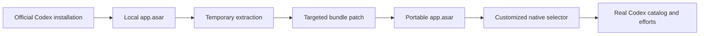

# Codex Native Selector

> A local customization of the Codex Desktop model selector, built from the Codex installation already present on Windows.

[](https://www.microsoft.com/windows)
[](https://openai.com/codex/)
[](LICENSE)

This project turns Codex's compact model selector into a clearer and faster interface: model variants in tabs, the native reasoning slider, model-specific animated colors, Fast mode, a settings button, and an automatically grouped model menu.

The project does not redistribute Codex or replace the official installation. It generates a local portable copy from the Codex installation already on your computer.

## Preview

```text
┌──────────────────────────────────────────────┐
│  Sol       Terra       Luna       ⚡    ⚙     │
│                                              │
│  ━━━━━━━━━━━━━━━━━━━━━━━━━━━━━━━●            │
└──────────────────────────────────────────────┘
              5.6 Terra  Very high
```

The ⚙ button opens the available model families, such as `5.6`, `5.5`, `5.4`, and `5.3 Codex Spark`. Variants remain in the top row, so the model menu does not duplicate `Sol`, `Terra`, `Luna`, or `Mini`.

## Features

- Uses Codex Desktop's native model-power slider component.
- Reads reasoning efforts from the real Codex model catalog.
- Shows model variants only when they actually exist.
- Displays a fixed `Full` tab for a family with no selectable variant.
- Groups the model menu automatically by model family.
- Recolors the Ultra animation using the active model family's color while preserving the native slider animation.
- Keeps Fast mode in the same row as the model variants.
- Renders the model menu above the interface through a DOM portal to avoid clipping and z-index issues.
- Creates a separate portable copy while leaving the official Microsoft Store installation untouched.

## How it works



The patch only targets the selector bundle and preserves the original application structure, components, events, and backend. The rest of the application is copied without modification.

## Installation

### Requirements

- Windows 10 or Windows 11.
- Codex Desktop installed officially, preferably through the Microsoft Store.
- Node.js 22.12 or newer.
- PowerShell.
- Codex fully closed while building and launching.

### 1. Clone the repository

```powershell
git clone https://github.com/Mirochill/codex-native-selector.git
Set-Location .\codex-native-selector
npm install
```

### 2. Find the installed Codex directory

The directory usually looks like this:

```text
C:\Program Files\WindowsApps\OpenAI.Codex_<version>_x64__2p2nqsd0c76g0\app
```

To automatically find the most recent version:

```powershell
$package = Get-ChildItem 'C:\Program Files\WindowsApps' -Directory -Filter 'OpenAI.Codex_*' |
  Sort-Object LastWriteTime |
  Select-Object -Last 1
$installApp = Join-Path $package.FullName 'app'
$installApp
```

If Windows denies access to `WindowsApps`, use the installation path shown in Codex's properties or enter the path manually.

### 3. Extract the official archive temporarily

This reads the local application but does not modify the official installation:

```powershell
Remove-Item .\work\asar-extracted -Recurse -Force -ErrorAction SilentlyContinue
npx --yes @electron/asar extract `
  (Join-Path $installApp 'resources\app.asar') `
  .\work\asar-extracted
```

### 4. Build the customized copy

```powershell
powershell.exe -NoProfile -ExecutionPolicy Bypass `
  -File .\tools\build-portable.ps1 `
  -InstallApp $installApp
```

The result is generated in:

```text
outputs\Codex-Native-Selector\
```

### 5. Launch Codex Native Selector

Close official Codex, including its tray icon in the Windows notification area, then launch:

```text
outputs\Codex-Native-Selector\Launch Codex Native Selector.cmd
```

The official and customized copies must not run at the same time because they use the same local Codex environment.

## Updating after a Codex update

The Codex frontend bundle can change its filenames or structure after an update. Rebuild from the new installation:

```powershell
Remove-Item .\work\asar-extracted -Recurse -Force -ErrorAction SilentlyContinue
npx --yes @electron/asar extract `
  (Join-Path $installApp 'resources\app.asar') `
  .\work\asar-extracted
powershell.exe -NoProfile -ExecutionPolicy Bypass `
  -File .\tools\build-portable.ps1 `
  -InstallApp $installApp
```

If the script reports that a chunk or function cannot be found, the Codex version has probably changed. Update the search markers in `tools/build-inplace-asar.mjs` and rebuild.

## Advantages

| Area | Benefit |
| --- | --- |
| No Codex fork | The project does not maintain a complete copy of the application. |
| No reinstallation | The copy is rebuilt from Codex already installed locally. |
| Official installation preserved | The Microsoft Store package is not overwritten. |
| Native components | The slider, its events, and model behavior remain Codex components. |
| Dynamic catalog | Models and reasoning efforts come from Codex's real configuration. |
| Targeted maintenance | The patch focuses on one frontend bundle. |

## Important limitations

- This is not an official plugin: Codex Desktop does not expose a public API for replacing its native UI with a plugin.
- The project currently targets Windows.
- The copy is tied to the Codex version and frontend chunk names used during the build.
- A Codex update may require changes to the patch.
- The official archive is not included on GitHub because of its size, redistribution concerns, and software ownership.
- The project does not bypass authentication, account limits, or service rules.
- The official instance must be closed before launching the customized copy.
- Available models still depend on the user's account, plan, and Codex backend.

## Troubleshooting

### The application stays on the OpenAI logo

Make sure that `app.asar` was extracted from the currently installed Codex version, then rebuild the copy. An old extracted archive may contain incompatible chunk names.

### The launcher says that another instance is open

Quit Codex from the Windows notification-area icon. Closing only the main window may leave the background process running.

### The selector does not show new models

Rebuild from the newest official archive. This project does not manufacture a model list: it reuses the catalog exposed by Codex.

### I want to return to official Codex

Close the customized copy, then launch Codex from the Start menu. No uninstall or file restoration is required.

## Repository structure

```text
tools/
├── build-portable.ps1       # Copies the local installation and creates the launcher
├── build-inplace-asar.mjs   # Applies the targeted app.asar patch
└── selector-v2.js.txt        # Customized selector component

README.md
LICENSE
.gitignore
package.json
```

The `outputs/`, `work/asar-extracted/`, and generated archives are ignored by Git so that a full Codex copy, local profile, or personal data cannot be published accidentally.

## License

The scripts and customization code in this repository are distributed under the [MIT License](LICENSE).

Codex Desktop, its components, resources, and models remain the property of their respective owners. This community project is not affiliated with or endorsed by OpenAI.
