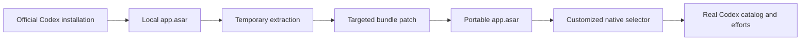

# Codex Native Selector

> A local customization of the Codex Desktop model selector, built from the Codex installation already present on macOS or Windows.

[](#installation)
[](https://openai.com/codex/)
[](LICENSE)

This project turns Codex's compact model selector into a clearer and faster interface: model variants in tabs, the native reasoning slider, model-specific animated colors, Fast mode ⚡ with slider glow, Ultimate power glow 🔥 on max, per-model effort memory, a settings button, and an automatically grouped model menu.

The project does not redistribute Codex or replace the official installation. It generates a local portable copy from the Codex installation already on your computer.

## Demo

<video src="docs/demo.mp4" poster="docs/demo-poster.jpg" width="392" height="332" controls autoplay muted loop playsinline></video>

> Drag to **MAX** → Range glows 🔥, thumb pulses, burst fires. Toggle **⚡ Fast** → slider re-tints. Tabs switch model families — effort is remembered per exact model.

## Preview

```text
┌──────────────────────────────────────────────┐
│  Sol       Terra       Luna       ⚡    ⚙     │
│                                              │
│  ━━━━━━━━━━━━━━━━━━━━━━━━━━━━━━━●            │
└──────────────────────────────────────────────┘
              5.6 Terra  Very high
```

The ⚙ button opens the available model families, such as `5.6`, `5.5`, `5.4`, and `5.3 Codex Spark`. Variants remain in the top row, so the model menu does not duplicate `Sol`, `Terra`, `Luna`, or `Mini`.

## Features

- Uses Codex Desktop's native model-power slider component (`Yms` + `impl-DQ1U0Spg.js` — tracks, ticks, bursts all tinted via `--a`).
- Reads reasoning efforts from the real Codex model catalog.
- Shows model variants only when they actually exist.
- Displays a fixed `Full` tab for a family with no selectable variant.
- Groups the model menu automatically by model family.
- Recolors the Ultra animation using the active model family's color while preserving the native slider animation.
- **Fast mode ⚡** — fully wired (forwards `serviceTierOptions` through `Yhs → _hs`, toggles `ltr(f)` → `Yms phase:active` particle stream).
- **Ultimate power glow 🔥** — rightmost slider position triggers `data-max=true` gradient + thumb/Track pulse + MaxBurst.
- **Per-model effort memory** — remembers the last reasoning effort per exact `gpt-*` model in `localStorage`.
- Keeps Fast mode in the same row as the model variants.
- Renders the model menu above the interface through a DOM portal (`yis.createPortal`) to avoid clipping and z-index issues.
- Creates a separate local copy while leaving the official installation untouched — auto-rebuilds on Store update via `Launch Codex Native Selector.ps1`.

## How it works


```mermaid
flowchart LR
    A[Official Codex installation] --> B[Local app.asar]
    B --> C[Temporary extraction]
    C --> D[Targeted bundle patch]
    D --> E[Portable app.asar]
    E --> F[Customized native selector]
    F --> G[Real Codex catalog and efforts]
```

The patch only targets the selector bundle and preserves the original application structure, components, events, and backend. The rest of the application is copied without modification.

## Installation

### Requirements

- macOS 12 or newer, Windows 10, or Windows 11.
- Codex Desktop installed officially.
- Node.js 22.12 or newer (tested on 24.9.0).
- Codex fully closed while building and launching.

### macOS

The official macOS bundle is currently installed as `/Applications/ChatGPT.app`, even though it identifies itself as Codex. The builder also detects older `/Applications/Codex.app` installations.

Clone the repository and install the dependencies:

```bash
git clone https://github.com/Mirochill/codex-native-selector.git
cd codex-native-selector
npm install
```

Build the customized app:

```bash
./tools/build-macos.sh
```

To use a nonstandard installation or output path, pass both explicitly:

```bash
./tools/build-macos.sh "/Applications/ChatGPT.app" \
  "$HOME/Applications/Codex Native Selector.app"
```

The default output is `~/Applications/Codex Native Selector.app`. The script extracts and patches a temporary copy, updates Electron's ASAR integrity digest, disables Sparkle updates for the copy, and ad-hoc signs the finished bundle. The official app is not modified. Avoid iCloud Drive and other File Provider destinations because they can attach metadata that invalidates a local app signature.

Quit the official Codex app, then launch:

```bash
open "$HOME/Applications/Codex Native Selector.app"
```

The official and customized copies must not run at the same time because they use the same Codex profile and bundle identity.

### Windows

PowerShell is required in addition to the common requirements above.

#### 1. Clone the repository

```powershell
git clone https://github.com/Mirochill/codex-native-selector.git
Set-Location .\codex-native-selector
npm install
```

#### 2. Build the customized copy

```powershell
powershell.exe -NoProfile -ExecutionPolicy Bypass `
  -File .\tools\build-portable.ps1
```

The builder detects the newest installed Microsoft Store package and extracts its archive automatically.
The result is generated in:

```text
outputs\Codex-Native-Selector\
```

#### 3. Launch Codex Native Selector

Close official Codex, including its tray icon in the Windows notification area, then launch:

```text
outputs\Codex-Native-Selector\Launch Codex Native Selector.cmd
```

The official and customized copies must not run at the same time because they use the same local Codex environment.
The launcher checks the installed Store version on every start and rebuilds the portable copy automatically when Codex has updated.

## Compatibility

Verified against **Codex 26.803.5235.0** (Store, `app-initial-CUcIZsiK.js` 13.1 MB, chunk `478af2a` @24062881). The patch is version-pinned — a Store update that renames minified symbols (`_hs/vhs`, `yis/o0/a0`, `Lhs/Bhs`) will need a new profile in `selector-compatibility.mjs`. The launcher detects drift automatically.

## Updating after a Codex update

The Codex frontend bundle can change its filenames or structure after an update. Rebuild from the new installation:

On macOS, quit Codex and rerun:

```bash
./tools/build-macos.sh
```

On Windows, close Codex fully and use the generated launcher. It detects the newest Store package and rebuilds automatically. You can also rerun `tools\build-portable.ps1` manually.

If the script reports that a chunk or function cannot be found, the Codex version has probably changed. Update the search markers in `tools/build-inplace-asar.mjs` and rebuild.

The builder discovers hashed model-selector and React DOM asset filenames automatically. Minified component names can still change between Codex releases; version-specific mappings live in `tools/selector-compatibility.mjs` and are covered by `npm run check`.

## Advantages

| Area | Benefit |
| --- | --- |
| No Codex fork | The project does not maintain a complete copy of the application. |
| No reinstallation | The copy is rebuilt from Codex already installed locally. |
| Official installation preserved | The installed app or Microsoft Store package is not overwritten. |
| Native components | The slider, its events, and model behavior remain Codex components. |
| Dynamic catalog | Models and reasoning efforts come from Codex's real configuration. |
| Targeted maintenance | The patch focuses on one frontend bundle. |

## Important limitations

- This is not an official plugin: Codex Desktop does not expose a public API for replacing its native UI with a plugin.
- The project currently targets macOS and Windows.
- The copy is tied to the Codex version and frontend chunk names used during the build.
- A Codex update may require changes to the patch.
- The macOS copy is ad-hoc signed for local use because changing `app.asar` invalidates the official signature. It is not a distributable or notarized build.
- The official archive is not included on GitHub because of its size, redistribution concerns, and software ownership.
- The project does not bypass authentication, account limits, or service rules.
- The official instance must be closed before launching the customized copy.
- Available models still depend on the user's account, plan, and Codex backend.

## Troubleshooting

### The application stays on the OpenAI logo

Make sure that `app.asar` was extracted from the currently installed Codex version, then rebuild the copy. An old extracted archive may contain incompatible chunk names.

### The launcher says that another instance is open

Quit Codex from the Windows notification-area icon. Closing only the main window may leave the background process running.

On macOS, quit Codex with <kbd>Command</kbd>+<kbd>Q</kbd> before opening the customized copy.

### macOS says the customized app is damaged or cannot be opened

Rebuild it locally from the official installation, then verify the local signature:

```bash
codesign --verify --deep --strict "$HOME/Applications/Codex Native Selector.app"
```

Do not copy a customized app built on another Mac. The generated bundle is intentionally ad-hoc signed for the machine that built it.

### The selector does not show new models

Rebuild from the newest official archive. This project does not manufacture a model list: it reuses the catalog exposed by Codex.

### The application shows “An error occurred” after a Codex update

Run `npm run check`, extract `app.asar` from the current official installation, and rebuild. React error 130 usually means Codex renamed a minified component used by the selector patch. Update the matching profile in `tools/selector-compatibility.mjs`; do not map JSX targets to JSX-runtime or lazy-loader objects.

### I want to return to official Codex

Close the customized copy, then launch Codex from the Start menu. No uninstall or file restoration is required.

## Repository structure

```text
docs/
├── demo.mp4                 # 22s screen capture — tabs, Fast, MAX glow
└── demo-poster.jpg          # Video poster frame
tools/
├── build-portable.ps1       # Copies the local installation and creates the launcher
├── build-macos.sh           # Builds and ad-hoc signs a separate macOS app bundle
├── build-inplace-asar.mjs   # Applies the targeted app.asar patch (handles a/i advanced view lock)
├── selector-compatibility.mjs # 5 profiles: legacy, 26.707×2, 26.721, 26.803 (supports 26.803.5235.0)
└── selector-v2.js.txt        # Customized selector component (tabs, Fast, MAX glow, effort memory)

README.md
LICENSE
.gitignore
package.json
```

The `outputs/`, `work/asar-extracted/`, and generated archives are ignored by Git so that a full Codex copy, local profile, or personal data cannot be published accidentally.

## License

The scripts and customization code in this repository are distributed under the [MIT License](LICENSE).

Codex Desktop, its components, resources, and models remain the property of their respective owners. This community project is not affiliated with or endorsed by OpenAI.
